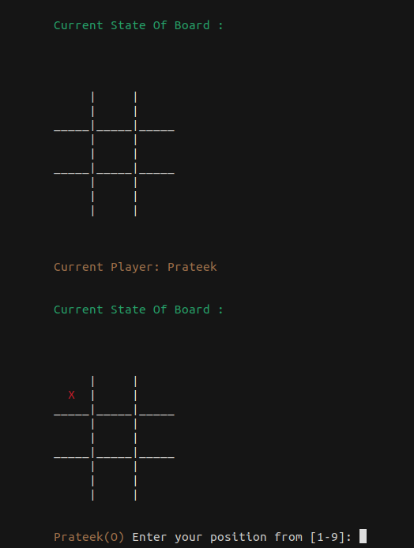
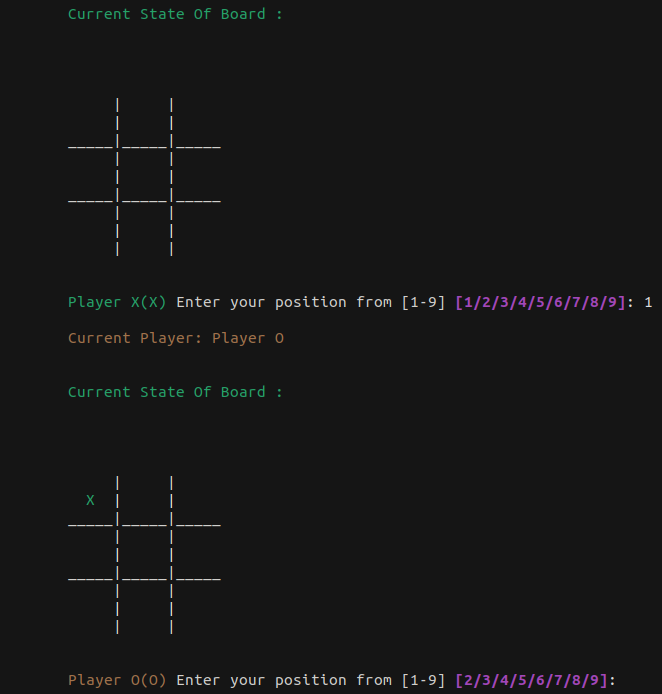
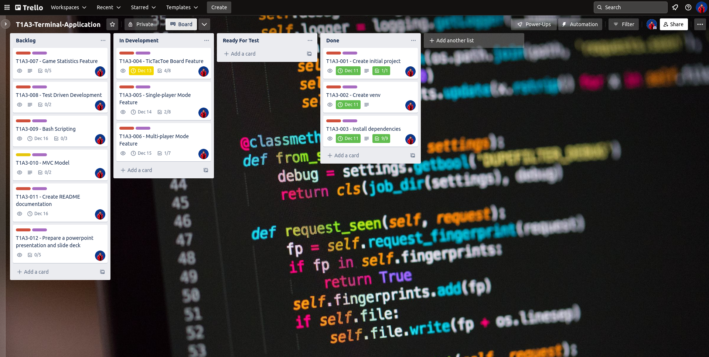
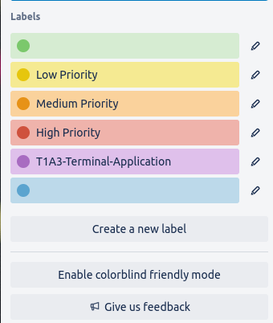

# Prateek Khindri's T1A3 Terminal Application - Unbeatable TicTacToe in Python3

## **How To Run the Application**

This application is best executed through a MacOSX terminal or a WSL terminal (such as Ubuntu).
Run any of the following commands from the terminal:

```
 ./bin/tic_tac_tac_toe.sh

 bash ./bin/tic_tac_toe.sh

 sh ./bin/tic_tac_toe.sh
```

More extensive instructions are provided below.

## **Link to Source Control Repository**

### **Github**

The Unbeatable TicTacToe project can be found in [GitHub](https://github.com/prateekkhindri/T1A3_terminal_application). Alternatively, please copy and paste the following link into a browser window.

```
https://github.com/prateekkhindri/T1A3_terminal_application
```

### **Presentation Video**

A link to the video presentation can be found here [link](). The video was uploaded to [Vimeo](https://vimeo.com/)

```
https://vimeo.com/
```

## **Style guide or styling conventions**

The unbeatable TicTacToe terminal application adheres to `Python Enhancement Proposal (PEP)8`, the official style guide for Python3 terminal applications. `PEP8` is a collection of rules for developing Python code that is consistent and readable. It covers a wide range of topics such as code layout, naming standards, and best practices for developing Python code.

Some of the key guidelines in PEP 8 include:

- Using 4 spaces per indentation level
- Using lowercase with words separated by underscores for function and variable names
- Using docstrings to document code
- Placing imports at the top of the file, one per line
- Using spaces around operators and after commas, but not inside parentheses or brackets

This project includes the Python package `autopep8` which formats Python code to comply to the 'PEP8' style guide. For more detailed information on the `PEP8` style guide, please refer to the official `PEP8` documentation [link](https://www.python.org/dev/peps/pep-0008/)

```
https://www.python.org/dev/peps/pep-0008/
```

## **Features**

The game has various distinguishing features making it stand out.

### **Choosing between SinglePlayer (Player vs Computer) and MultiPlayer Mode**

The application starts by asking the user if they want to play a game. A welcome screen appears, asking the user if they want to play in SinglePlayer or Multiplayer mode.

Users can add their names after selecting SinglePlayer mode, otherwise the default choice will be selected. Users can choose between playing as 'X' or 'O'. 'X' is always first. The player information is then shown, followed by the TicTacToe board. The machine makes a move based on the user's symbol choices. The user must enter their moves into the game board, and the application will then check for any problems. If the move is valid, the application will process it and update the game board as illustrated below.



The application will also save the user's score. When either a win or a draw position is reached, the game is over.

When playing in MultiPlayer mode, users can provide their names for playing as 'X' and for playing as 'O'. If no names are entered, the default option will be selected. Following that, the player information is presented, including the user's name and symbol. As demonstrated below, the application will display two game boards and prompt both users to enter their moves.



The application will then compare the two moves to determine the winner. The application will also save the user's score. When either a win or a draw position is reached, the game is over.

In either mode, the application will also use variables to store data such as the user's score (wins, losses and draw), the game board and the game state. Furthermore, the application will use loops and conditional control structures to check for errors and update the game board accordingly. Finally, the application will also use error handling to catch any unexpected errors and display an appropriate error message to the user.

### **Artificial Intelligence (AI)**

The purpose of implementing Artificial Intelligence (AI) was to make the game unbeatable. The application simulates the decision-making process of a two-player game using the minimax algorithm from artificial intelligence. It involves creating a tree of all possible moves and their resulting board states for both players, and then evaluating each state to determine the optimal move for the player whose turn it is.

The minimax function in the application returns the best move given a particular board and player. The function takes the board and player as arguments to check and see if the board is in a winning state. If it is, the function will return the score of the board multiplied by the player. If the board is not in a winning state, the code will loop through all the positions on the board and set the position to the player. It will then call the minimax function again, this time passing in the new board and the opposite player. The score of this move is then stored. If the score is better than the current best score, the position and score are updated. This loop is repeated for all positions on the board. If the board is in a draw state (no more positions to play), the function returns 0. Otherwise, the function returns the best score and position.

Error handling has been used to ensure that any invalid moves, such as those that would result in a position already occupied, will be rejected. Variable scope has been used to ensure that all variables used within the algorithm will remain within the scope of the algorithm and will not be accessible outside of it. Finally, loops have been used to ensure that the algorithm can repeat its calculations until a winning move is found.

### **JSON and Session file management system (Saving/Loading Games From File)**

Users have the option of saving game statistics (wins, losses and draws) as well as keeping track of their every move for any game played. Game statistics (wins, losses, and draws) for SinglePlayer and MultiPlayer mode games are saved to a local `JSON` file. This data can be obtained at any time as long as there is a valid `JSON` file and the data in the file is in a valid format.

In addition, the session file management system allows users to store game data and user preferences persistently. User game sessions are saved in a distinct `TXT` file for SinglePlayer and MultiPlayer mode games. This helps the user to keep track of their gaming progress. The session files are stored securely and are updated with each move made by the user.

To handle the flow of the game, the application uses variables and conditional control structures. This enables the application to determine whether a player wins or loses, as well as when a draw occurs. Variables are also used by the application to maintain track of each user's game progress and player data. The application handles any errors that may arise during gameplay, such as attempting an invalid move or loading a faulty `JSON` or `TXT` game file.

## **Flow Chart**

[Control Flow diagram]()

## **Implementation Plan and Design**

The [Trello](https://trello.com/) project management platform was used to manage the application's implementation plan and design. I was successful at planning, prioritising, and organising my activities into digestible portions.



Each task was color-coded according to priority, with red representing high priority, orange representing medium priority, and yellow representing low priority. In addition, for each activity, a checklist of checklist items was provided, which aided in breaking down the tasks into smaller components. Finally, each job was assigned a serial number, which made it much easier to make frequent commits to a remote repository.

The color-coded scheme is depicted below.



A link to the [Trello](https://trello.com/) workspace can be found [here](https://trello.com/b/52yMJzhX/t1a3-terminal-application)

```
https://trello.com/b/52yMJzhX/t1a3-terminal-application
```

## **Help Documentation**

### **How to install and run the application**

There are several ways for downloading and installing the TicTacToe application.

- **NOTE:** You must have python3 installed on the system in order to run this application

1. Clone the git repository using the command:

   ```
   git clone prateekkhindri/T1A3_terminal_application
   ```

2. Alternatively, you can download the application as a `.ZIP` file from the repository link https://github.com/prateekkhindri/T1A3_terminal_application.

   Simply click on `Code` and then `Download ZIP` to download all files in a ZIP file.

3. Then, open the command line terminal app.

   - If running from a UNIX system, Mac, LINUX distribution system such as (Ubuntu), navigate to the application folder, and type in command line:

   ```
   pip3 install -r  ./requirements.txt
   ./bin/tic_tac_toe.sh
   ```

   - Alternatively, if using Windows, open Windows Powershell, navigate to the app folder, and type:

   ```
   pip3 install -r  ./requirements.txt

   ```

   Any dependencies required by the application will be installed after you run the `pip3 install -r  ./requirements.txt` command.

   If the packages don't get installed correctly, you can use the `pip3 install` command to install the following python3 packages manually:

   ```
   pip3 install numpy
   pip3 install prompt_toolkit
   pip3 install uuid
   pip3 install emoji
   pip3 install rich
   pip3 install termcolor
   pip3 install pyfiglet
   pip3 install pytest
   pip3 install autopep8
   ```

4. Run the app by typing in the command line:
   If using UNIX, Mac, Linux, Ubuntu, WSL, simply run:

   ```
    ./bin/tic_tac_toe.sh
   ```

   If using Windows Powershell:

   ```
    python3 ./bin/tic_tac_toe.sh
   ```

### **Dependencies**

The application uses nine python3 packages, namely:

```
   pip3 install numpy
   pip3 install prompt_toolkit
   pip3 install uuid
   pip3 install emoji
   pip3 install rich
   pip3 install termcolor
   pip3 install pyfiglet
   pip3 install pytest
   pip3 install autopep8
```

Before the application can be used, the user must install these python3 packages.

### **Hardware Requirements**

The TicTacToe game is expected to run in practically any Unix, Linux, Mac, or Windows-based system. Overall, the hardware and software requirements for running this terminal application are not overly demanding, and most modern computers should be able to run it without any issues.
